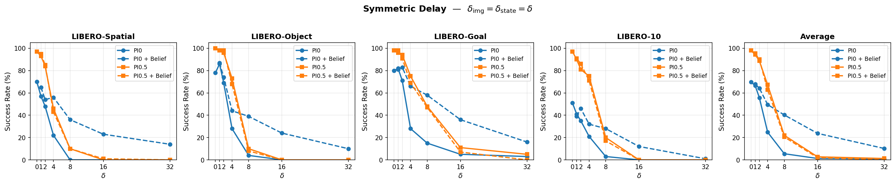
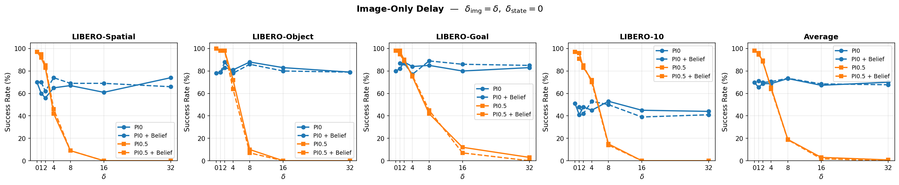
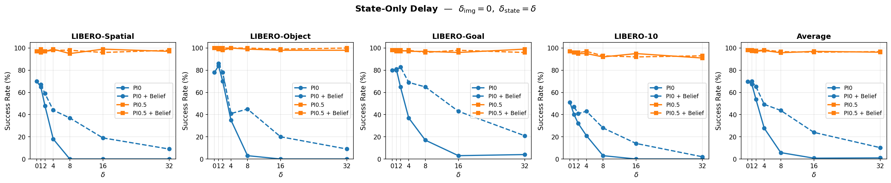

# Benchmarking Observation Delays in Vision-Language-Action Models (Under Development)

<p align="center">
  <a href="./LICENSE"></a>
</p>

A **research fork** of [LeRobot](https://github.com/huggingface/lerobot) for systematically benchmarking how per-modality sensor latency degrades VLA policy performance, and whether a learned belief predictor can recover it. All original LeRobot functionality is preserved — delay simulation activates only when explicitly configured.

---

## Table of Contents

- [Motivation](#motivation)
- [Results](#results)
- [Quick Start](#quick-start)
- [Belief Prediction](#belief-prediction)
- [Observation Masking](#observation-masking)
- [What This Fork Modifies](#what-this-fork-modifies)
- [Installation](#installation)
- [Citation](#citation)
- [Acknowledgments](#acknowledgments)

---

## Motivation

VLA policies are trained and evaluated under ideal zero-delay conditions, but real deployments face **sensor latency**: cameras incur capture-and-transfer delays, proprioceptive readings lag behind the control loop, and network communication introduces jitter. Their behavior under realistic latency is poorly understood.

### Why Belief Prediction Instead of State Augmentation?

A natural compensation strategy is **state augmentation** — appending action history to the observation. This is incompatible with pretrained VLAs for two reasons:

1. **Input dimension mismatch.** In LIBERO, state is 8-D (`eef_pos(3) + eef_axisangle(3) + gripper_qpos(2)`), images come from two cameras (`observation.images.image` and `observation.images.wrist_image`, both 256×256×3), and each action is 7-D (`Δpos(3) + Δaxisangle(3) + gripper_cmd(1)`). With delay δ the input becomes `8 + 7δ`-dimensional, breaking the pretrained input projection.

2. **Nonlinear state–action relationship.** Rotations compose on SO(3) via the Rodrigues formula, and the gripper responds to binary commands through non-trivial dynamics — simple delta accumulation is physically incorrect.

**Our solution:** train a small GRU-based **belief predictor** `(delayed_state, action_history) → predicted_current_state` that outputs in the **same 8-D space**, requiring zero VLA architectural change. A single ~50K-parameter model handles variable delay δ ∈ {1, …, δ_max} via variable-length GRU processing.

---

## Results

### Delay vs. Task Success Rate (LIBERO)

**Symmetric Delay** ($\delta_{\mathrm{img}}=\delta_{\mathrm{state}}=\delta$)
<p align="center">
  
</p>

**Image-Only Delay** ($\delta_{\mathrm{img}}=\delta,\ \delta_{\mathrm{state}}=0$)
<p align="center">
  
</p>

**State-Only Delay** ($\delta_{\mathrm{img}}=0,\ \delta_{\mathrm{state}}=\delta$)
<p align="center">
  
</p>

Detailed per-task tables: **[PI0](results/results_summary_pi0.md)** | **[PI0.5](results/results_summary_pi05.md)**

Regenerate with `python summarize_eval.py`.

---

## Quick Start

```bash
# Symmetric 1-step delay on LIBERO
lerobot-eval \
  --env.type=libero \
  --env.task=libero_spatial,libero_object,libero_goal,libero_10 \
  --policy.path=lerobot/pi0_libero_finetuned \
  --observation_delay_steps='{"observation.images": 1, "observation.state": 1}'

# Image-only delay (4 steps), state real-time
lerobot-eval ... \
  --observation_delay_steps='{"observation.images": 4, "observation.state": 0}'

# State-only delay (8 steps), images real-time
lerobot-eval ... \
  --observation_delay_steps='{"observation.images": 0, "observation.state": 8}'
```

Output directories encode delay parameters automatically:
```
outputs/eval/2026-03-08/14-04-55_libero_pi0_delay_images4_state0_comp-none/
```

Without `--observation_delay_steps`, behavior is identical to upstream LeRobot.

---

## Belief Prediction (Experimental)

The belief system uses a **shared-backbone architecture**: modality-specific encoder/decoder heads are connected to a single shared GRU that processes the action sequence. All modalities are predicted in a **single forward pass**, enabling cross-modal information flow through the shared backbone.

```
state_delayed  →  StateEncoder  → latent_s ─┐
image1_delayed →  ImageEncoder1 → latent_i1 ─┼── concat → SharedGRU(actions) → h_final
image2_delayed →  ImageEncoder2 → latent_i2 ─┘                                   │
                                                    ┌───────── split ─────────────┘
                                                    ↓           ↓             ↓
                                              StateDec    ImgDec1       ImgDec2
                                                    ↓           ↓             ↓
                                              + residual   + residual    + residual
```

| Component | Architecture | Typical params |
|-----------|-------------|---------------|
| **State encoder** | MLP → latent | ~33K |
| **Image encoder** | CNN (4-stage) → pool → FC → latent | ~600K each |
| **Shared GRU** | 2-layer GRU, hidden=256 | ~1M |
| **State decoder** | latent → MLP → state_dim | ~66K |
| **Image decoder** | FC → reshape → transposed CNN | ~600K each |
| **Total** (state + 2 images) | — | **~3–4M** |

**Train from one dataset** (default trains all modalities: state + main camera + wrist camera):
```bash
python -m lerobot.scripts.train_belief \
  --repo_id lerobot/libero_goal_image \
  --delays 1 2 4 8 16 32 \
  --epochs 100 \
  --output_dir outputs/belief
```

**Train from ALL LIBERO suites** (recommended for best generalization):
```bash
python -m lerobot.scripts.train_belief \
  --repo_id lerobot/libero_spatial_image \
            lerobot/libero_object_image \
            lerobot/libero_goal_image \
            lerobot/libero_10_image \
  --delays 1 2 4 8 16 32 \
  --output_dir outputs/belief_all
```

**Multi-GPU training** (automatically splits data across GPUs):
```bash
# Via torchrun (interactive)
torchrun --nproc_per_node=4 -m lerobot.scripts.train_belief \
  --repo_id lerobot/libero_spatial_image \
            lerobot/libero_object_image \
            lerobot/libero_goal_image \
            lerobot/libero_10_image \
  --delays 1 2 4 8 16 32 \
  --batch_size 64 \
  --output_dir outputs/belief_all \
  --epochs 10 \
  --debug 10000
```

> Each GPU processes `batch_size` samples per step, so effective batch
> size = `batch_size × num_gpus`.  The script auto-detects `torchrun`
> environment variables and uses `DistributedDataParallel` + `DistributedSampler`.

**Evaluate with belief compensation:**
```bash
lerobot-eval \
  --env.type=libero \
  --env.task=libero_spatial,libero_object,libero_goal,libero_10 \
  --env.max_parallel_tasks=1 \
  --eval.batch_size=1 \
  --eval.n_episodes=10 \
  --policy.path=lerobot/pi0_libero_finetuned \
  --policy.n_action_steps=10 \
  --observation_delay_steps='{"observation.images": 4, "observation.state": 4}' \
  --delay_compensation=belief \
  --delay_compensation_keys='["observation.state", "observation.images"]' \
  --belief_model_path=outputs/belief_all
```

**Custom predictor** — subclass `BaseBeliefPredictor` and register:
```python
from lerobot.utils.belief_predictor import BaseBeliefPredictor, register_belief_predictor

@register_belief_predictor("my_predictor")
class MyPredictor(BaseBeliefPredictor):
    CONFIG_CLS = MyConfig  # dataclass with save()/load()
    def __init__(self, cfg): ...
    def forward(self, delayed_obs, action_seq): ...
```

---

## Observation Masking

A debug utility for diagnosing **modality sensitivity**: zero-out selected observation channels to measure each model's dependence on state vs. images.

```bash
# Mask state → test image-only performance
lerobot-eval \
  --env.type=libero \
  --policy.path=lerobot/pi0_libero_finetuned \
  --observation_mask_keys='["observation.state"]'

# Mask images → test state-only performance
lerobot-eval ... \
  --observation_mask_keys='["observation.images"]'

# Mask both (sanity check — policy sees nothing)
lerobot-eval ... \
  --observation_mask_keys='["observation.state", "observation.images"]'
```

Masking works **independently of delay** — use it standalone or combine with delay:
```bash
# Delay + mask: 4-step image delay with state zeroed out
lerobot-eval ... \
  --observation_delay_steps='{"observation.images": 4, "observation.state": 0}' \
  --observation_mask_keys='["observation.state"]'
```

Output directories encode mask parameters automatically:
```
outputs/eval/2026-03-10/14-00-00_libero_pi0_mask-state/
outputs/eval/2026-03-10/14-00-00_libero_pi0_mask-images/
outputs/eval/2026-03-10/14-00-00_libero_pi0_mask-images+state/
outputs/eval/2026-03-10/14-00-00_libero_pi0_delay_images4_state0_comp-none_mask-state/
```

---

## What This Fork Modifies

All changes are **additive and backward-compatible**.

| Component | File(s) | Summary |
|-----------|---------|---------|
| Delay buffer | `utils/observation_delay.py` *(new)* | Per-key FIFO delay with prefix matching, shared-backbone belief integration, and observation masking |
| Belief models | `utils/belief_predictor.py` *(new)* | SharedBackboneBeliefPredictor (shared GRU + modality heads) + legacy per-modality predictors |
| Belief training | `scripts/train_belief.py` *(new)* | Joint training of all modalities in single forward passes |
| Configs | `configs/eval.py`, `configs/train.py` | Delay + compensation + masking fields; delay/mask-aware output naming |
| Dataset | `datasets/factory.py`, `datasets/lerobot_dataset.py` | Offline delay shift in `delta_timestamps` |
| Eval / Train | `scripts/lerobot_eval.py`, `scripts/lerobot_train.py` | Online delay buffer + belief model + masking in rollout |

All paths relative to `src/lerobot/`.

---

## Installation

```bash
git clone https://github.com/QingyuanWuNothing/DelayedVLAs.git
cd DelayedVLAs
pip install -e ".[dev]"
```

For platform-specific setup, see the upstream [Installation Guide](https://huggingface.co/docs/lerobot/installation). Full [LeRobot documentation](https://huggingface.co/docs/lerobot/index) applies — all original features (ACT, Diffusion, PI0, SmolVLA, GR00T, hardware control, etc.) are preserved.

---

## Citation

```bibtex
@inproceedings{cadenelerobot,
  title={LeRobot: An Open-Source Library for End-to-End Robot Learning},
  author={Cadene, Remi and Alibert, Simon and Capuano, Francesco and Aractingi, Michel and Zouitine, Adil and Kooijmans, Pepijn and Choghari, Jade and Russi, Martino and Pascal, Caroline and Palma, Steven and Shukor, Mustafa and Moss, Jess and Soare, Alexander and Aubakirova, Dana and Lhoest, Quentin and Gallou\'edec, Quentin and Wolf, Thomas},
  booktitle={The Fourteenth International Conference on Learning Representations},
  year={2026},
  url={https://arxiv.org/abs/2602.22818}
}
```

```bibtex
@misc{wu2026delaysvla,
    title  = {Benchmarking Observation Delays in Vision-Language-Action Models},
    author = {Wu, Qingyuan and Zhan, Sinong Simon and Wang, Yuhui and Dai, Yanning and Zhu, Qi and Huang, Chao},
    year   = {2026},
    url    = {https://github.com/QingyuanWuNothing/DVLAs}
}
```

---

## Acknowledgments

Built upon [**LeRobot**](https://github.com/huggingface/lerobot) by the Hugging Face team. Licensed under [Apache 2.0](./LICENSE), same as upstream.